# :sun_behind_rain_cloud: SAP BTP Integration Suite – Integração de Clima (Cenário IoT)
## :pushpin: Visão Geral


Este projeto demonstra um cenário de integração utilizando o SAP Integration Suite (Cloud Integration) para consumir dados de clima em tempo real através de uma API pública de meteorologia.

O objetivo é simular um cenário real de logística ou IoT, onde um sistema precisa verificar as condições climáticas antes de realizar operações como:

:truck: entregas

:package: transporte de cargas

:building_construction: operações externas

:bar_chart: planejamento logístico

A integração consulta uma API externa de clima, interpreta os dados recebidos e classifica automaticamente o clima com base em condições meteorológicas e temperatura.

### :globe_with_meridians: API Utilizada

Foi utilizada a API gratuita Open-Meteo.

Endpoint:

https://api.open-meteo.com/v1/forecast?latitude=${property.latitude}&longitude=${property.longitude}&current_weather=true

Exemplo real:

https://api.open-meteo.com/v1/forecast?latitude=-23.68&longitude=-46.62&current_weather=true


# :building_construction: Arquitetura do iFlow

O fluxo foi desenvolvido no SAP Cloud Integration (CPI) seguindo as etapas abaixo.
### Criando nosso Iflow

<br>

### Criando o Integration Flow
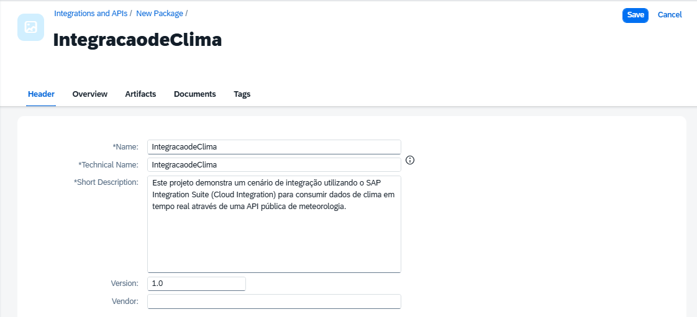
```
IntegracaodeClima
```
<br>

### Adicionando o Artefato do Integration Flow
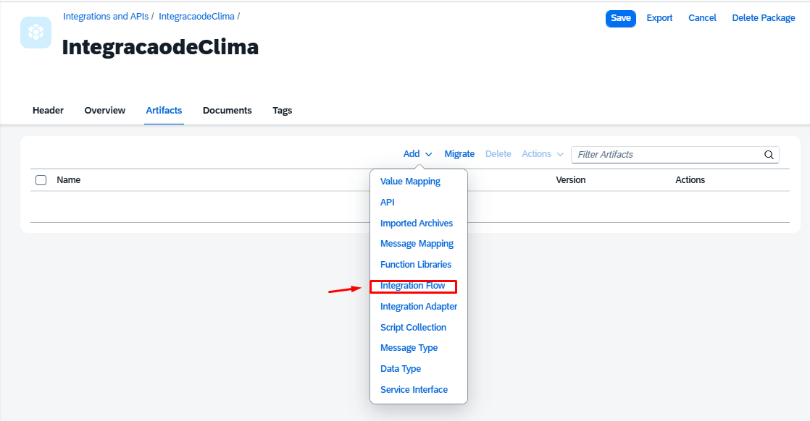

<br>

### Criando o Integration Flow
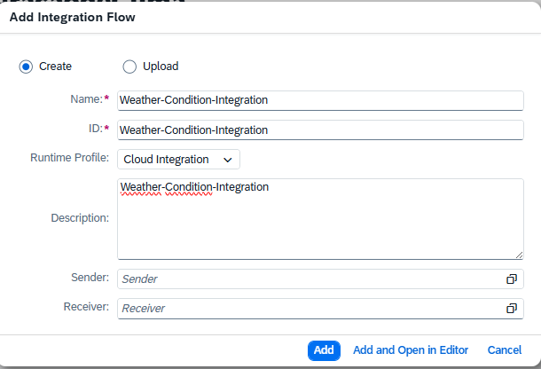
```
Weather-Condition-Integration
```
<br>
:gear: Etapas da Integração

<br>

### :one:  HTTPS Sender

O fluxo é iniciado através de um endpoint HTTPS, permitindo que aplicações externas consultem o serviço de clima.
### Configurando o Endpoint
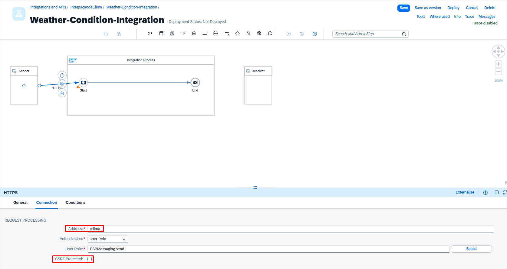

```
/clima
```
<br>

### :two: Content Modifier – Definição da cidade

Nesta etapa são definidas as coordenadas geográficas da cidade consultada.

Exemplo utilizado:

latitude  = -23.68
longitude = -46.62

Essas coordenadas representam a cidade de São Paulo.

### Adicionando o Content Modifier
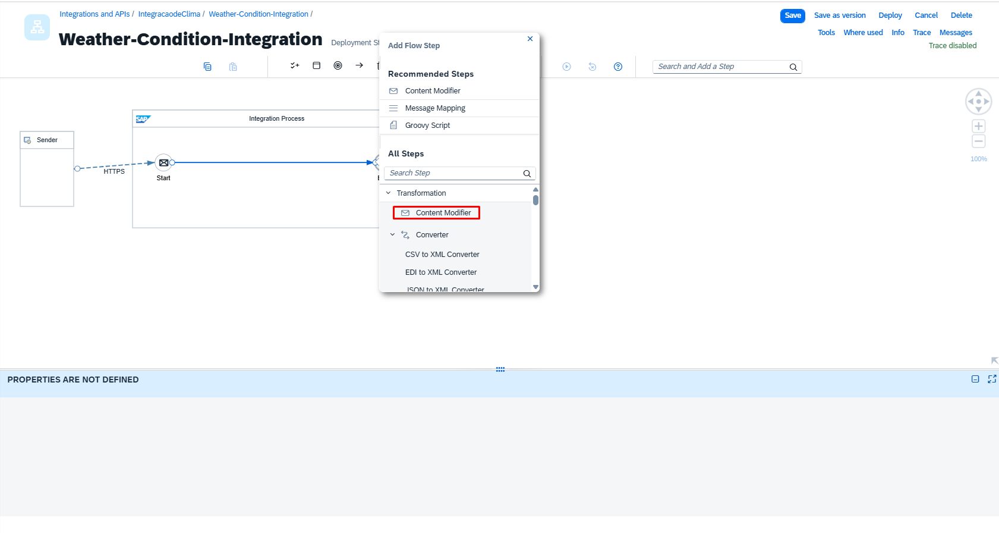

<br>

### Configurando o Content Modifier - Property
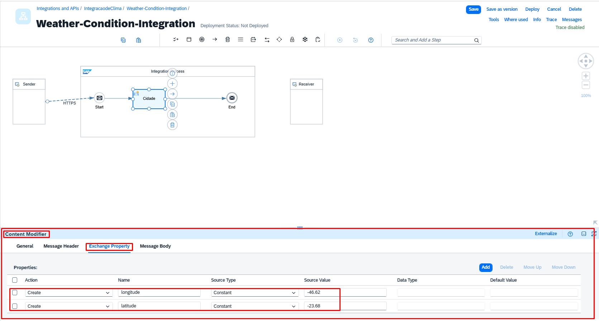
Renomeamos o Content Modifier 
```
General
Name: cidade
```
Em Property adicionamos
```
Exchange Property
create   -   longitude   -   Constant   -   -46.62
create   -   latitude   -    Constant   -    -23.68
```

<br>

### Renomeamos o Receiver
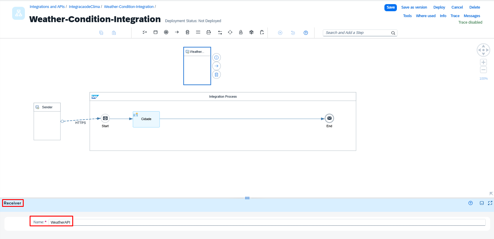
```
WeatherAPI
```

<br>

### :three: Request Reply – Consumo da API

O CPI realiza uma chamada HTTP para a API Open-Meteo, buscando as condições climáticas atuais.

O retorno é recebido no formato JSON.

### Adicionamos o Request Reply
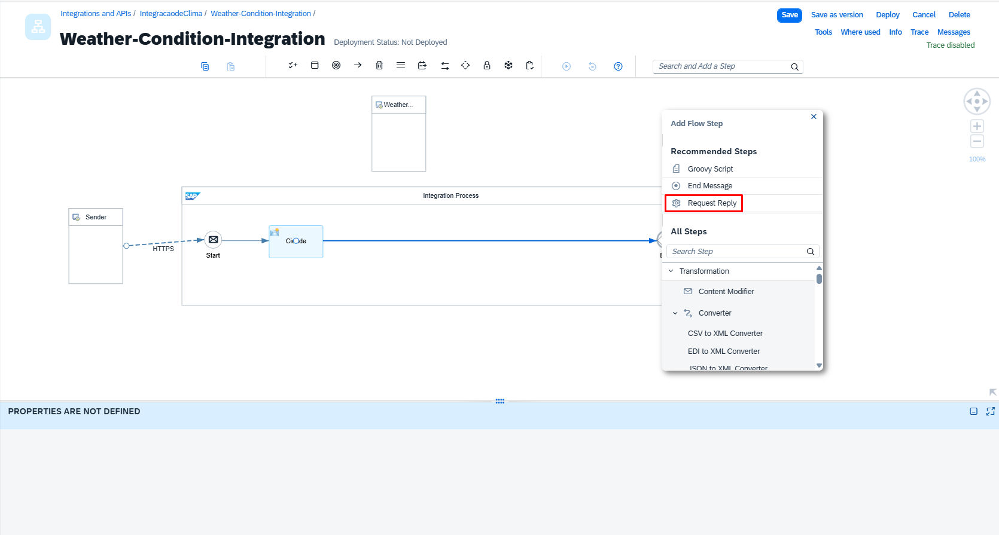

<br>

### Adicionamos o Adapter HTTP
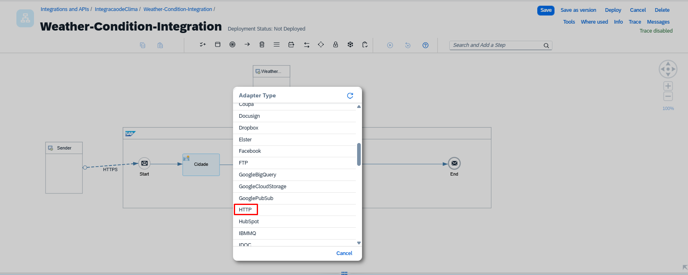

<br>

### Configuração do Request Reply
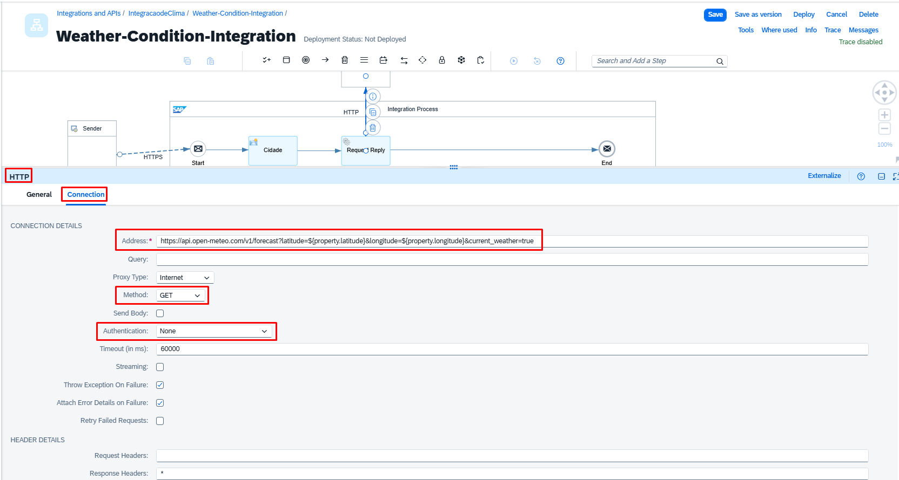
```
Address: https://api.open-meteo.com/v1/forecast?latitude=${property.latitude}&longitude=${property.longitude}&current_weather=true
Proxy Type: Internet
Method: GET
Authentication: None
```

<br>

### :four: JSON → XML Converter

Como o SAP CPI trabalha melhor com XML em expressões XPath, o JSON retornado pela API é convertido para XML.

Exemplo simplificado do XML gerado:
```
<root>
   <current_weather>
      <temperature>22.5</temperature>
      <weathercode>3</weathercode>
   </current_weather>
</root>
```

<br>

### Adicionando o JSON → XML Converter
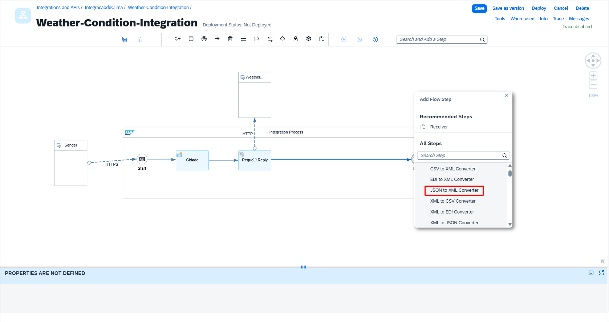

<br>

### Configurando o JSON → XML Converter
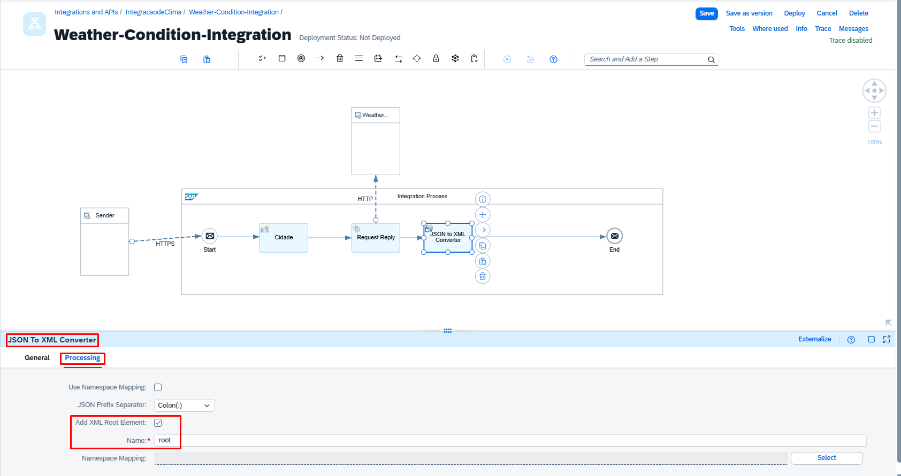
Em Processing
```
Add XML Root Element
Name: root
```

<br>

### :five: Router – Classificação Inteligente do Clima

O Router analisa os dados recebidos e classifica o clima em diferentes cenários com base em:

weathercode

temperatura

Exemplos de regras implementadas:

☀️ Sol agradável weathercode = 0 temperature > 15 temperature <= 25 <br>
🌥 Nublado frio weathercode = 3 temperature <= 15 <br>
🌫 Névoa weathercode = 45 ou 48 <br>
❄ Neve weathercode entre 71 e 86 <br>
🌧 Chuva weathercode entre 51 e 82 <br>

Cada condição também considera faixas de temperatura:

Status	Temperatura <br>
FRIO	≤ 15°C <br>
AGRADÁVEL	15°C – 25°C <br>
QUENTE	≥ 25°C <br>

### Adicionamos o Router
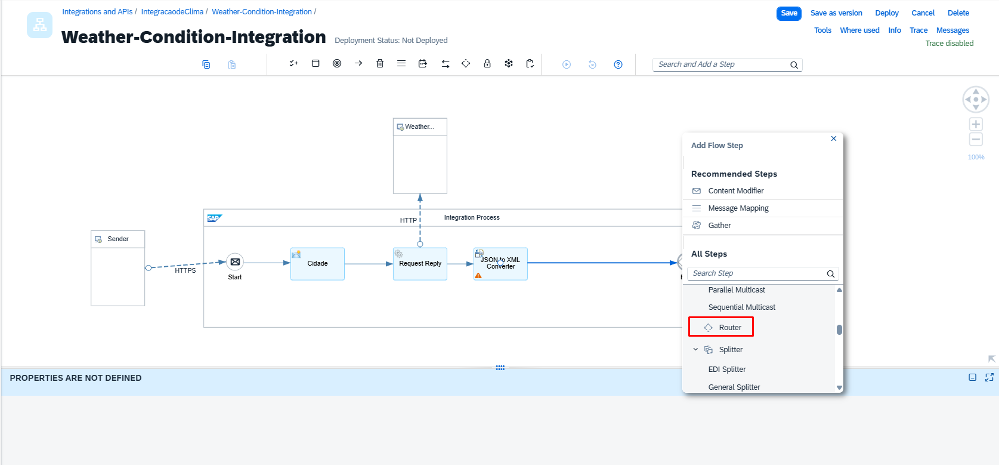

<br>

### Definindo a Route 1 Default
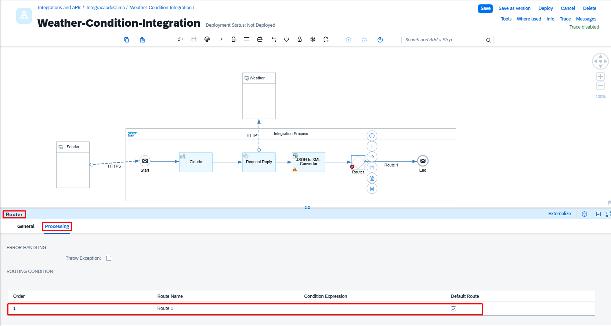

<br>

### :six:  Content Modifier – Status	Erro


Quando houver erro na temperatura, o mesmo vai retornar um XML
### Adicionando o Content Modifier
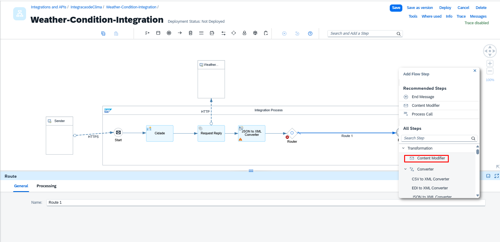

<br>

### Configurando o Body 
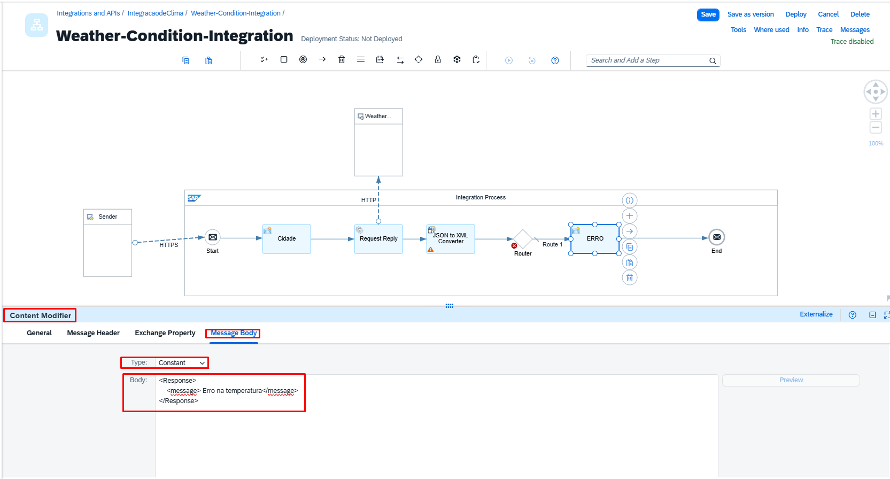
```
Type: Constant
```

```
Body:
<Response>
    <message> Erro na temperatura</message>
</Response>
```

<br>

### :seven: Content Modifier

<br>

### Adicionar Content Modifier
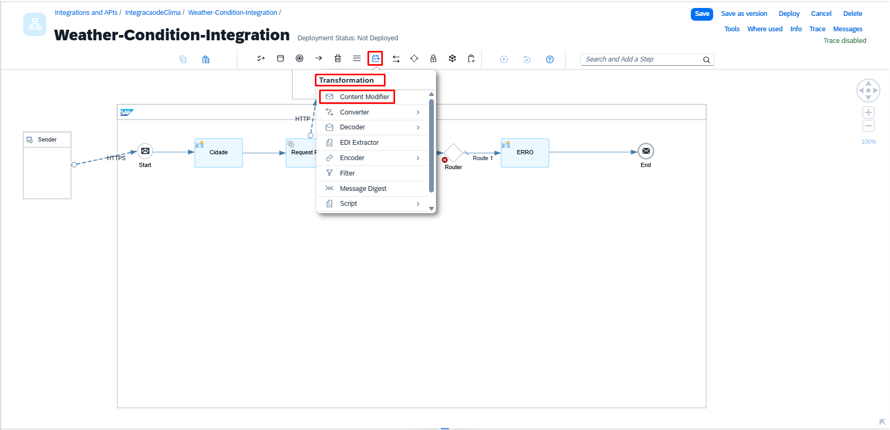

Vamos renomear cada Content Modifiy

<br>

### Configurando o Property Content Modifier
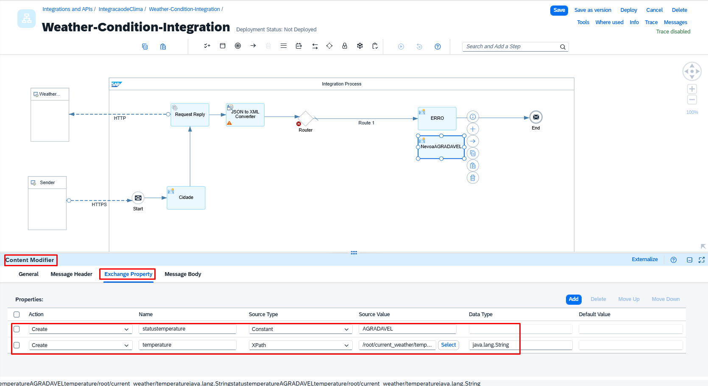
```
Content Modifier - NevoaAGRADAVEL
Exchange Property
Create - statustemperature - Constant - AGRADAVEL
Create - temperature - XPath - /root/current_weather/temperature - java.lang.String
```

<br>

### Configurando o Body Content Modifier
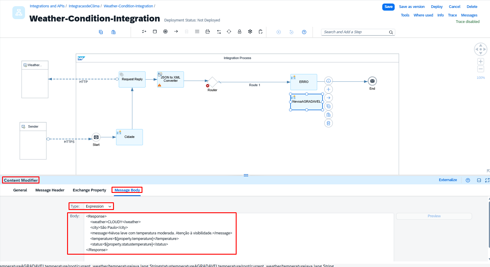
```
Message Body
Type: Expression
Body: 
<Response>
    <weather>CLOUDY</weather>
    <city>São Paulo</city>
    <message>Névoa leve com temperatura moderada. Atenção à visibilidade.</message>
    <temperature>${property.temperature}</temperature>
    <status>${property.statustemperature}</status>
</Response>
```

<br>

### TESTE
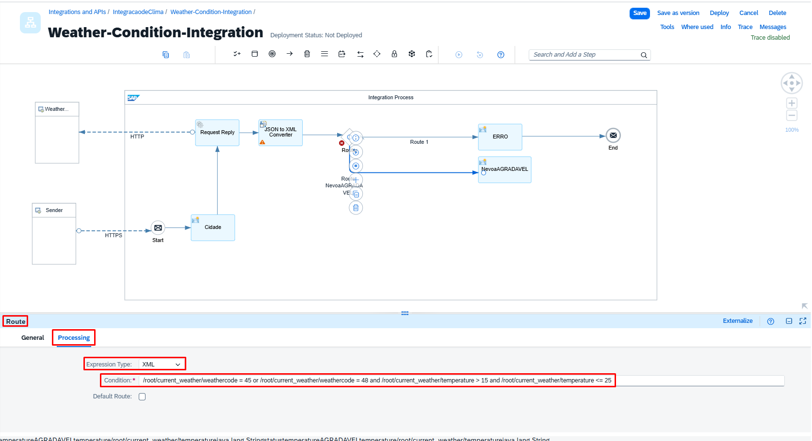
<br>

### TESTE
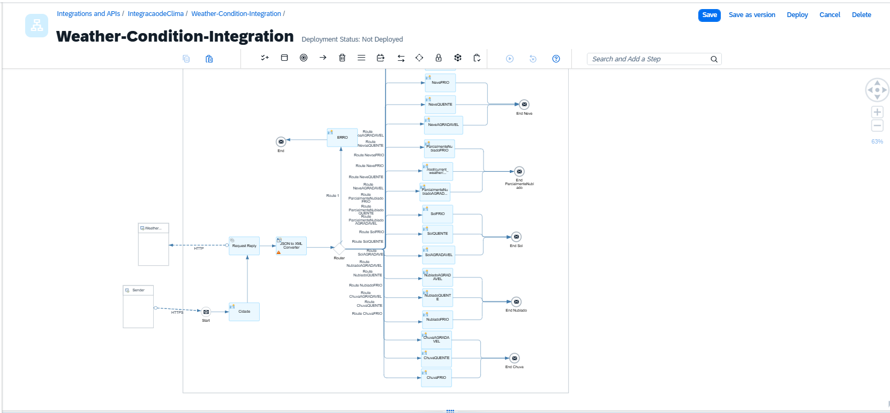

<br>

### TESTE
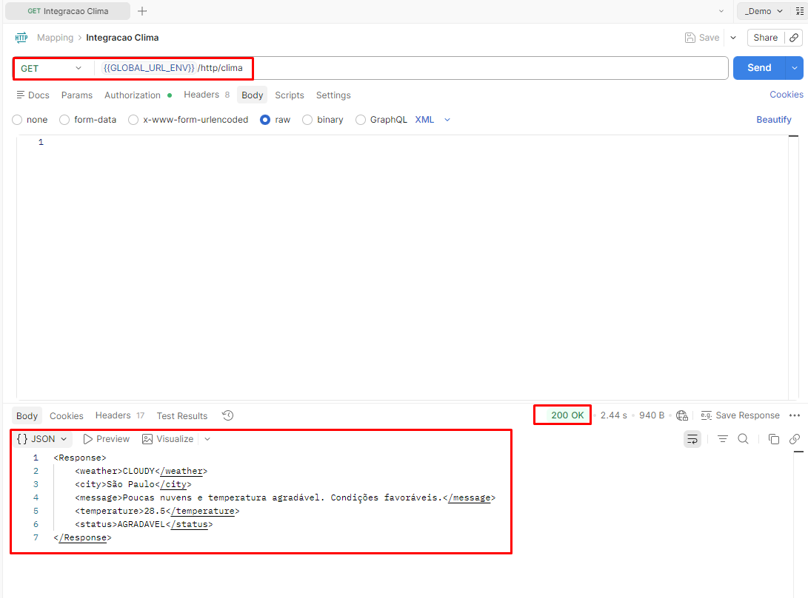

### TESTE


<br>
<br>
<br>
<br>
<br>
<br>
<br>
<br>
<br>
<br>
<br>


☀️ Sol quente <br>

☀️ Sol frio <br>

🌥 Nublado agradável <br>

🌫 Névoa <br>

❄ Neve <br>

🌧 Chuva <br>

🌤 Parcialmente nublado <br>

Cada cenário gera uma mensagem específica para o sistema de logística.

📦 Exemplo de Resposta da Integração

```
<Response>
    <weather>CLOUDY</weather>
    <city>São Paulo</city>
    <message>Céu nublado com temperatura confortável. Clima estável.</message>
    <temperature>22.3</temperature>
    <status>AGRADAVEL</status>
</Response>
```


🧠 Lógica de Negócio

O fluxo aplica uma lógica de decisão baseada em:

interpretação do código meteorológico

faixa de temperatura

classificação operacional

Essa abordagem permite que sistemas externos tomem decisões como:

adiar entregas

alertar motoristas

ajustar rotas

planejar operações externas

:rocket: Tecnologias Utilizadas

SAP BTP Integration Suite

SAP Cloud Integration (CPI)

Open-Meteo Weather API

JSON → XML Conversion

XPath Routing

Content Modifier

HTTP Integration

💡 Possíveis Evoluções do Projeto

Este cenário pode ser expandido para:

integração com SAP Event Mesh

alertas automáticos para sistemas logísticos

dashboards em SAP Analytics Cloud

automação de rotas de entrega

integração com sistemas IoT


# 👨‍💻 Author Jean Cardoso de Souza


# 🔗 LinkedIn
### https://www.linkedin.com/in/jean-cardoso-de-souza


🌦	:sun_behind_rain_cloud: <br>
📌	:pushpin: <br>
🌐	:globe_with_meridians: <br>
🏗	:building_construction: <br>
☀️	:sunny: <br>
🌥	:sun_behind_cloud: <br>
🌫	:fog: <br>
❄	:snowflake: <br>
🌧	:cloud_with_rain: <br>
📦	:package: <br>
🚀	:rocket: <br> 
💡	:bulb: <br>
✅	:white_check_mark: <br>
