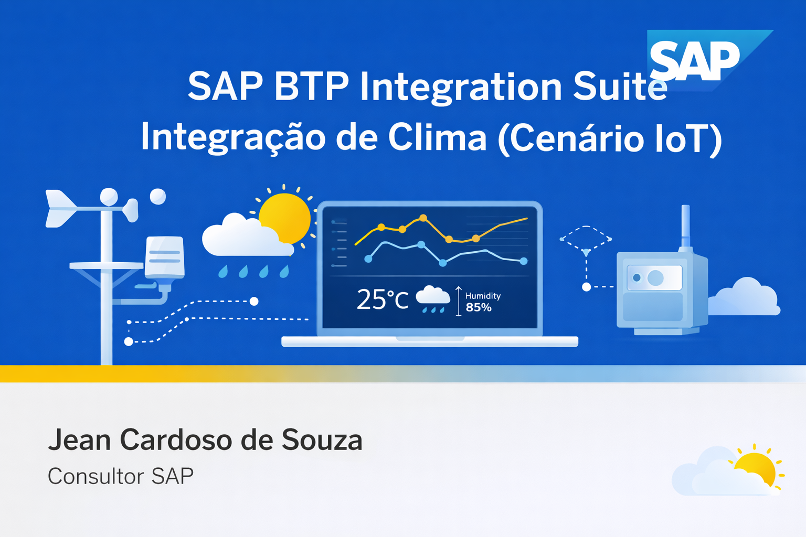

# :sun_behind_rain_cloud: SAP BTP Integration Suite – Integração de Clima (Cenário IoT)
## :pushpin: Visão Geral

Este projeto demonstra um cenário de integração utilizando o SAP Integration Suite (Cloud Integration) para consumir dados de clima em tempo real através de uma API pública de meteorologia.

O objetivo é simular um cenário real de logística ou IoT, onde um sistema precisa verificar as condições climáticas antes de realizar operações como:

:truck: entregas

:package: transporte de cargas

:building_construction: operações externas

:bar_chart: planejamento logístico

A integração consulta uma API externa de clima, interpreta os dados recebidos e classifica automaticamente o clima com base em condições meteorológicas e temperatura.

### :globe_with_meridians: API Utilizada

Foi utilizada a API gratuita Open-Meteo.

Endpoint:

https://api.open-meteo.com/v1/forecast?latitude=${property.latitude}&longitude=${property.longitude}&current_weather=true

Exemplo real:

https://api.open-meteo.com/v1/forecast?latitude=-23.68&longitude=-46.62&current_weather=true

# 🏗 Arquitetura do iFlow

O fluxo foi desenvolvido no SAP Cloud Integration (CPI) seguindo as etapas abaixo.

HTTPS Sender
     ↓
Content Modifier (definir cidade / coordenadas)
     ↓
Request Reply (Open-Meteo API)
     ↓
JSON to XML Converter
     ↓
Router (classificação do clima)
     ↓
Content Modifier (montagem da resposta)
     ↓
Response Message
⚙ Etapas da Integração
### 1️⃣ HTTPS Sender

O fluxo é iniciado através de um endpoint HTTPS, permitindo que aplicações externas consultem o serviço de clima.

### 2️⃣ Content Modifier – Definição da cidade

Nesta etapa são definidas as coordenadas geográficas da cidade consultada.

Exemplo utilizado:

latitude  = -23.68
longitude = -46.62

Essas coordenadas representam a cidade de São Paulo.

### 3️⃣ Request Reply – Consumo da API

O CPI realiza uma chamada HTTP para a API Open-Meteo, buscando as condições climáticas atuais.

O retorno é recebido no formato JSON.

### 4️⃣ JSON → XML Converter

Como o SAP CPI trabalha melhor com XML em expressões XPath, o JSON retornado pela API é convertido para XML.

Exemplo simplificado do XML gerado:

<root>
   <current_weather>
      <temperature>22.5</temperature>
      <weathercode>3</weathercode>
   </current_weather>
</root>
### 5️⃣ Router – Classificação Inteligente do Clima

O Router analisa os dados recebidos e classifica o clima em diferentes cenários com base em:

weathercode

temperatura

Exemplos de regras implementadas:

☀️ Sol agradável
weathercode = 0
temperature > 15
temperature <= 25
🌥 Nublado frio
weathercode = 3
temperature <= 15
🌫 Névoa
weathercode = 45 ou 48
❄ Neve
weathercode entre 71 e 86
🌧 Chuva
weathercode entre 51 e 82

Cada condição também considera faixas de temperatura:

Status	Temperatura
FRIO	≤ 15°C
AGRADÁVEL	15°C – 25°C
QUENTE	≥ 25°C
📊 Exemplos de Cenários Detectados

## O iFlow consegue identificar automaticamente situações como:

☀️ Sol quente

☀️ Sol frio

🌥 Nublado agradável

🌫 Névoa

❄ Neve

🌧 Chuva

🌤 Parcialmente nublado

Cada cenário gera uma mensagem específica para o sistema de logística.

📦 Exemplo de Resposta da Integração
<Response>
    <weather>CLOUDY</weather>
    <city>São Paulo</city>
    <message>Céu nublado com temperatura confortável. Clima estável.</message>
    <temperature>22.3</temperature>
    <status>AGRADAVEL</status>
</Response>
🧠 Lógica de Negócio

O fluxo aplica uma lógica de decisão baseada em:

interpretação do código meteorológico

faixa de temperatura

classificação operacional

Essa abordagem permite que sistemas externos tomem decisões como:

adiar entregas

alertar motoristas

ajustar rotas

planejar operações externas

:rocket: Tecnologias Utilizadas

SAP BTP Integration Suite

SAP Cloud Integration (CPI)

Open-Meteo Weather API

JSON → XML Conversion

XPath Routing

Content Modifier

HTTP Integration

💡 Possíveis Evoluções do Projeto

Este cenário pode ser expandido para:

integração com SAP Event Mesh

alertas automáticos para sistemas logísticos

dashboards em SAP Analytics Cloud

automação de rotas de entrega

integração com sistemas IoT

✅ Esse tipo de projeto demonstra conhecimentos em:

SAP BTP

Integração com APIs externas

Design de iFlows

Processamento de dados em tempo real

💡 Dica para seu portfólio (muito forte):

Esse projeto mostra que você sabe trabalhar com:

APIs públicas

lógica de decisão

integração real

# 👨‍💻 Author Jean Cardoso de Souza

# 🔗 LinkedIn
### https://www.linkedin.com/in/jean-cardoso-de-souza

🌦	:sun_behind_rain_cloud:  
📌	:pushpin:  
🌐	:globe_with_meridians:  
🏗	:building_construction:  
☀️	:sunny:  
🌥	:sun_behind_cloud:  
🌫	:fog:  
❄	:snowflake:  
🌧	:cloud_with_rain:  
📦	:package:  
🚀	:rocket:   
💡	:bulb:  
✅	:white_check_mark:  
